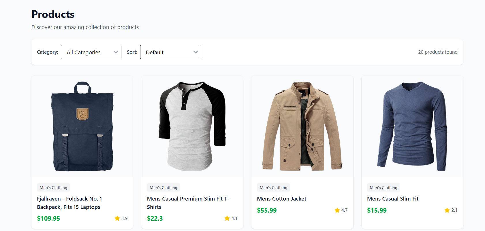
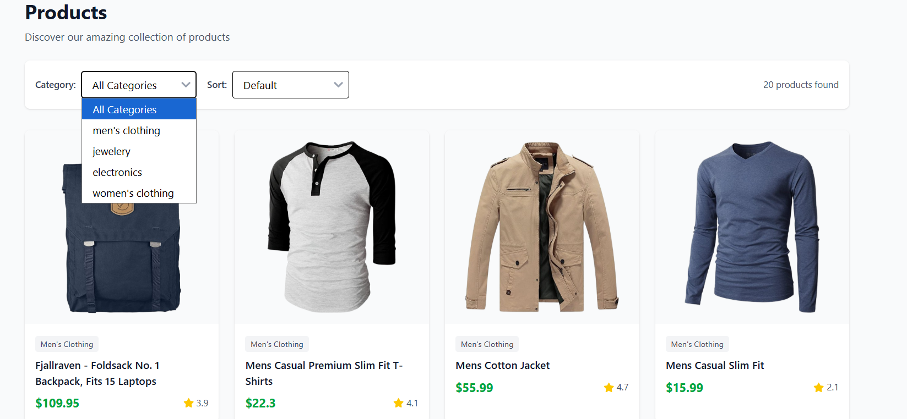
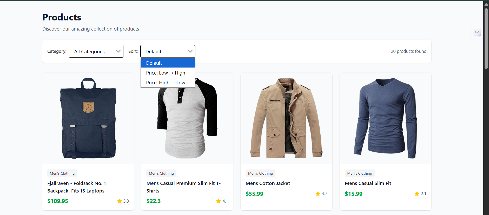
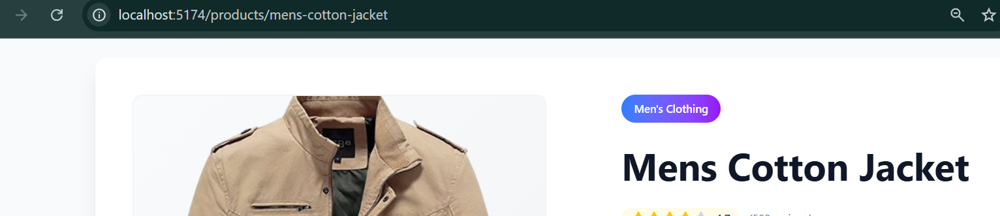

🛍️ Ecommerce UI

This is a React project that displays products with filters, sorting, skeleton loaders, and a product detail page using SWR.
It also includes category selection, responsive design, and a clean UI with Tailwind CSS.

🚀 Features

✅ Fetch products from API using SWR
✅ Search & filter products by category
✅ Sort products by price (Low → High / High → Low)
✅ Click on a product to view its details
✅ Skeleton loaders while data is loading
✅ Responsive design with Tailwind CSS + React Icons

📂 Project Structure
src/
│── components/
│   ├── EcommerceUI.jsx         # Main product listing with 
│   ├── ProductDescription.jsx  # Product detail page
│   ├── ProductSkeleton.jsx     # Skeleton loader for products
│
│── util/
│   ├── fetcher.js              # Fetch function used by SWR
│
│── Context.js                  # Context API for product details
│── App.js                      # Routes & root component
│── index.js                    # Entry point

⚙️ Installation Steps

1️⃣ Clone the Repository

git clone https://github.com/WaseemAhmad9977/assignmentRepo.git
cd ecommerce-ui

2️⃣ Install Dependencies

npm install

3️⃣ Run the Project

npm run dev

This will start the development server on 👉 http://localhost:5173/

📸 Screenshots

### 🏠 Dashboard  
  

### 📝 filter by category 
  

### 📝 sort by price
  

### 📝 productModel
  

### 📝 proper maintained dynamic route(slug)
  

React 18

SWR

Tailwind CSS

React Icons

React Router DOM

React Loading Skeleton