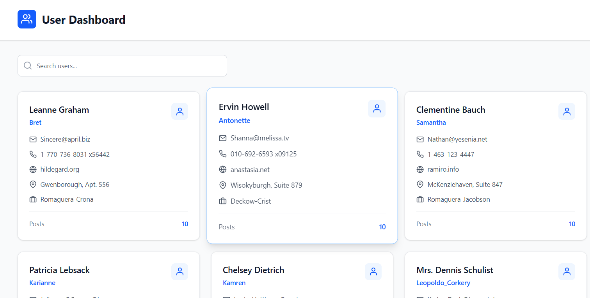
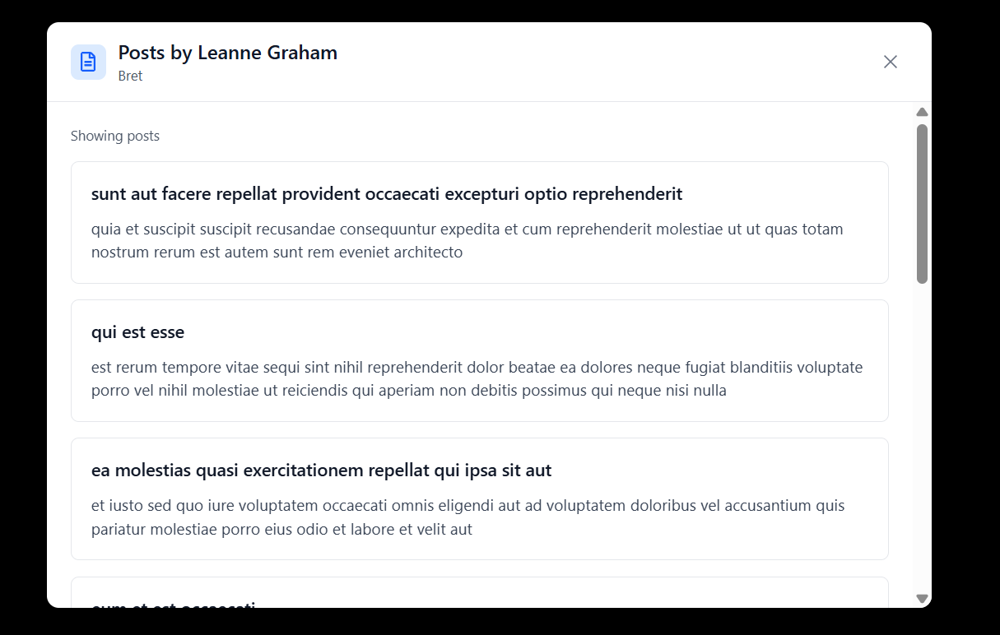

📊 User Post Dashboard

This is a React project that displays a list of users and their posts using SWR (React data fetching library).
It also includes a search feature, skeleton loading screens, and a modal popup to view a user’s posts.

🚀 Features

✅ Fetch users and posts from API using SWR

✅ Search users by name

✅ Click on a user to view all their posts in a modal

✅ Skeleton loaders while data is loading

✅ Clean UI with Tailwind CSS and React Icons

📂 Project Structure
src/
│── components/
│   ├── UserPostDashboard.jsx   # Main dashboard with user cards
│   ├── UserPostModal.jsx       # Modal to show selected user's p
│   ├── UserSkeleton.jsx        # Skeleton loader for user cards
│
│── util/
│   ├── fetcher.js              # Fetch function used by SWR
│
│── App.js                      # Root component
│── index.js                    # Entry point

⚙️ Installation Steps

Follow these steps to set up the project locally:

1️⃣ Clone the Repository
git clone https://github.com/WaseemAhmad9977/assignmentRepo.git
cd user-post-dashboard

2️⃣ Install Dependencies

Make sure you have Node.js (>=14) installed. Then run:

npm install

3️⃣ Run the Project
npm run dev

This will start the development server on http://localhost:5173/

### 🏠 Dashboard  
  

### 📝 User Posts 
  

